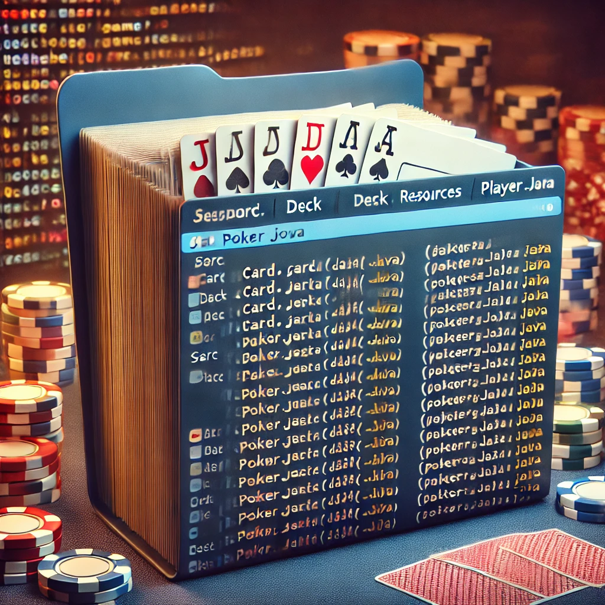

The following project imitates Video Poker game.

1) class Card represent the card in a game and have the following methods: 
- sameSuit : to check if the cars have the same suit when we check the hand later
- compareTo : to sort the arraylist and to check the ranks of cards
- toString : to present the cards to the player

2) class Deck represents the deck on the table and consists of 52 cards, it has the following methods:
- shuffle: uses java.Random for shuffling,then takes two random indexes and switches between those two cards for extra randomness.
- deal: takes the card with the index top and give to Player

3) class Player represents the player entity with its hand, bankroll and number of bets. Implements the following methods:
- add a card
- removes a card
- bets : updated the bets and the balance
- winnings : updates the balance after the game
- get a bankroll : shows the player what is his current balance

4) class Game imitates the game flow for one player. Has the following methods:
- play: main method to run the game
- checkHand: checks if the hand of the player equals any of the following [royal flush, straight flush, four of a kind, and etc...]
